# Components Architecture

This document provides a detailed view of all components and their sub-components.

## Complete Component Hierarchy

```mermaid
graph TB
    subgraph "Presentation Layer"
        subgraph "Controllers"
            AppController[AppController<br/>Main Orchestrator]
            EditorController[EditorController<br/>Monaco Editor]
            ToolbarController[ToolbarController<br/>Toolbar Buttons]
            StatusController[StatusController<br/>Status & Validation]
            ExportController[ExportController<br/>Code Export]
            ResizeController[ResizeController<br/>Resize Handle]
        end

        subgraph "Factories"
            MonacoFactory[MonacoEditorFactory<br/>Editor Creation]
        end
    end

    subgraph "Application Layer"
        subgraph "Services"
            DiagramService[DiagramService<br/>Main Service]
        end

        subgraph "Use Cases"
            ParseDSLUseCase[ParseDSLUseCase<br/>DSL Parsing]
            ExportDSLUseCase[ExportDSLUseCase<br/>Code Export]
        end

        subgraph "Registries"
            ExportRegistry[ExportFormatRegistry<br/>Export Strategies]
        end
    end

    subgraph "Domain Layer"
        subgraph "Entities"
            Entity[Entity<br/>Database Table]
            Field[Field<br/>Table Column]
            Relationship[Relationship<br/>Table Relation]
        end

        subgraph "Value Objects"
            Position[Position<br/>X,Y Coordinates]
        end

        subgraph "Layout Services"
            LayerEngine[LayerClassificationEngine<br/>Main Layout]
            Orchestrator[LayerClassificationOrchestrator<br/>Phase Coordinator]
            LayerClassifier[LayerClassifier<br/>Graph Classification]
            CrossingMinimizer[CrossingMinimizer<br/>Barycenter Method]
            VerticalOptimizer[SourceAwareVerticalOptimizer<br/>Vertical Alignment]
            FieldOrderer[FieldOrderingAlgorithm<br/>Field Sorting]
            MagneticOptimizer[MagneticAlignmentOptimizer<br/>Magnetic Alignment]
            LayoutPositioner[LayoutPositioner<br/>Position Calculator]
        end

        subgraph "Repository Interfaces"
            IRenderer[IRenderer<br/>Rendering Contract]
            IZoomableRenderer[IZoomableRenderer<br/>Zoom Contract]
            IInteractiveRenderer[IInteractiveRenderer<br/>Interactive Contract]
            IDiagramRepository[IDiagramRepository<br/>Diagram Contract]
            IDSLParser[IDSLParser<br/>Parsing Contract]
            ILogger[ILogger<br/>Logging Contract]
        end
    end

    subgraph "Infrastructure Layer"
        subgraph "Renderers"
            CanvasAdapter[CanvasRendererAdapter<br/>Main Adapter]
            ViewportManager[ViewportManager<br/>Zoom & Pan]
            InteractionHandler[CanvasInteractionHandler<br/>Mouse Events]
            EntityRenderer[EntityRenderer<br/>Entity Drawing]
            RelationshipRenderer[RelationshipRenderer<br/>Relationship Drawing]
            CanvasOrchestrator[CanvasLayoutOrchestrator<br/>Layout Execution]
        end

        subgraph "Parsers"
            DSLAdapter[DSLParserAdapter<br/>Main Adapter]
            DSLLexer[DSLLexer<br/>Tokenization]
            MetadataParser[MetadataParser<br/>Metadata Parsing]
            DecoratorParser[DecoratorParser<br/>Decorator Parsing]
            EntityParser[EntityParser<br/>Entity Parsing]
            FieldParser[FieldParser<br/>Field Parsing]
            RelationshipParser[RelationshipParser<br/>Relationship Parsing]
        end

        subgraph "Exporters"
            SQLExporter[SQLExporter<br/>SQL DDL Export]
            JSONExporter[JSONExporter<br/>JSON Schema Export]
            TypeScriptExporter[TypeScriptExporter<br/>TS Interfaces Export]
            TypeMapper[TypeMapper<br/>Type Conversion]
        end

        subgraph "Utilities"
            Logger[Logger<br/>Logging Service]
            RelationshipResolver[RelationshipTypeResolver<br/>Type Resolution]
        end
    end

    subgraph "Data Layer"
        DefaultData[default_data.ts<br/>Default DSL Schema]
        Utils[models/utils.ts<br/>Helper Functions]
    end

    %% Relationships
    AppController --> EditorController
    AppController --> ToolbarController
    AppController --> StatusController
    AppController --> ExportController
    AppController --> ResizeController
    AppController --> DiagramService

    DiagramService --> ParseDSLUseCase
    DiagramService --> ExportDSLUseCase
    DiagramService --> IRenderer

    ParseDSLUseCase --> IDSLParser
    ExportDSLUseCase --> ExportRegistry

    ExportRegistry --> SQLExporter
    ExportRegistry --> JSONExporter
    ExportRegistry --> TypeScriptExporter

    CanvasAdapter --> ViewportManager
    CanvasAdapter --> InteractionHandler
    CanvasAdapter --> EntityRenderer
    CanvasAdapter --> RelationshipRenderer
    CanvasAdapter --> CanvasOrchestrator

    DSLAdapter --> DSLLexer
    DSLAdapter --> MetadataParser
    DSLAdapter --> DecoratorParser
    DSLAdapter --> EntityParser
    DSLAdapter --> FieldParser
    DSLAdapter --> RelationshipParser

    LayerEngine --> Orchestrator
    Orchestrator --> LayerClassifier
    Orchestrator --> CrossingMinimizer
    Orchestrator --> VerticalOptimizer

    EditorController --> DefaultData

    SQLExporter --> TypeMapper
    TypeScriptExporter --> TypeMapper

    style Entity fill:#e1f5ff
    style Field fill:#e1f5ff
    style Relationship fill:#e1f5ff
    style AppController fill:#c8e6c9
    style DiagramService fill:#c8e6c9
    style CanvasAdapter fill:#ffccbc
    style DSLAdapter fill:#ffccbc
```

## Component Breakdown by Layer

### 1. Presentation Layer (6 components)

#### AppController (Orchestrator)
- **Responsibility**: Coordinates all sub-controllers
- **Complexity**: 90 lines (80% reduced from 430)
- **Dependencies**: All 5 sub-controllers + DiagramService

#### EditorController
- **Responsibility**: Monaco editor management
- **Functions**: initialize, getValue, setValue, format, reset, save
- **Dependencies**: MonacoEditorFactory, default_data

#### ToolbarController
- **Responsibility**: Toolbar button interactions
- **Functions**: setupEventListeners (zoom, fit, autoLayout)
- **Dependencies**: DiagramService

#### StatusController
- **Responsibility**: Status display and validation
- **Functions**: updateStatus, updateInfo, updateZoomLevel, showValidation
- **Dependencies**: DiagramService, Lucide icons

#### ExportController
- **Responsibility**: Code export functionality
- **Functions**: export (with format selection)
- **Dependencies**: DiagramService, 4 export formats

#### ResizeController
- **Responsibility**: Resize handle management
- **Functions**: setupResizeHandle
- **Dependencies**: DOM manipulation

### 2. Application Layer (4 components)

#### DiagramService
- **Responsibility**: Main application service
- **Functions**: parseDSL, renderDiagram, zoomIn, zoomOut, fitToScreen, autoLayout, exportCode
- **Dependencies**: Use cases, IRenderer, IDiagramRepository

#### ParseDSLUseCase
- **Responsibility**: DSL parsing orchestration
- **Functions**: execute
- **Dependencies**: IDSLParser

#### ExportDSLUseCase
- **Responsibility**: Code export orchestration
- **Functions**: execute
- **Dependencies**: Exporters

#### ExportFormatRegistry
- **Responsibility**: Export strategy management
- **Pattern**: Strategy + Registry
- **Functions**: register, execute
- **Dependencies**: IExporter implementations

### 3. Domain Layer (16 components)

#### Entities (3)
- **Entity**: Database table representation
- **Field**: Table column representation
- **Relationship**: Table relation representation

#### Value Objects (1)
- **Position**: X,Y coordinates

#### Layout Services (8)
- **LayerClassificationEngine**: Main layout algorithm entry point
- **LayerClassificationOrchestrator**: Coordinates 5 layout phases
- **LayerClassifier**: Graph layer classification using Floyd-Warshall
- **CrossingMinimizer**: Barycenter-based crossing minimization
- **SourceAwareVerticalOptimizer**: Vertical alignment optimization
- **FieldOrderingAlgorithm**: Field sorting within entities
- **MagneticAlignmentOptimizer**: Magnetic field alignment
- **LayoutPositioner**: Final position calculation

#### Repository Interfaces (4)
- **IRenderer / IZoomableRenderer / IInteractiveRenderer**: Rendering contracts (ISP)
- **IDiagramRepository / IDSLParser**: Parsing contracts (ISP)
- **ILogger**: Logging contract (DIP)

### 4. Infrastructure Layer (17 components)

#### Renderers (6)
- **CanvasRendererAdapter**: Main adapter (implements IRenderer)
- **ViewportManager**: Zoom and pan transformations
- **CanvasInteractionHandler**: Mouse event handling
- **EntityRenderer**: Entity drawing on canvas
- **RelationshipRenderer**: Relationship line drawing
- **CanvasLayoutOrchestrator**: Layout algorithm execution

#### Parsers (7)
- **DSLParserAdapter**: Main adapter (implements IDiagramRepository)
- **DSLLexer**: Tokenization (comment removal, line splitting)
- **MetadataParser**: Metadata key-value parsing
- **DecoratorParser**: Decorator annotation parsing
- **EntityParser**: Entity declaration parsing
- **FieldParser**: Field declaration parsing
- **RelationshipParser**: Relationship declaration parsing

#### Exporters (4)
- **SQLExporter**: SQL DDL generation
- **JSONExporter**: JSON Schema generation
- **TypeScriptExporter**: TypeScript interfaces generation
- **TypeMapper**: Type conversion between DSL types and target types

#### Utilities (2)
- **Logger**: Logging service (implements ILogger)
- **RelationshipTypeResolver**: Relationship type resolution

### 5. Data Layer (2 components)
- **default_data.ts**: Default DSL schema
- **models/utils.ts**: Helper functions

## Component Statistics

| Layer | Components | Total Lines | Avg Complexity |
|-------|-----------|-------------|----------------|
| Presentation | 6 | ~450 | Low |
| Application | 4 | ~200 | Low |
| Domain | 16 | ~1,500 | Medium |
| Infrastructure | 17 | ~1,800 | Medium |
| Data | 2 | ~200 | Low |
| **Total** | **45** | **~4,150** | **Low-Medium** |

## SRP Decomposition Summary

| Original Class | Lines | New Components | Total Lines | Reduction |
|----------------|-------|----------------|-------------|-----------|
| CanvasRendererAdapter | 467 | 5 classes | 200 | 57% |
| DSLParserAdapter | 216 | 6 classes | 96 | 56% |
| AppController | 430 | 5 classes + 1 data | 90 | 80% |
| **Total** | **1,113** | **17 components** | **386** | **65%** |
