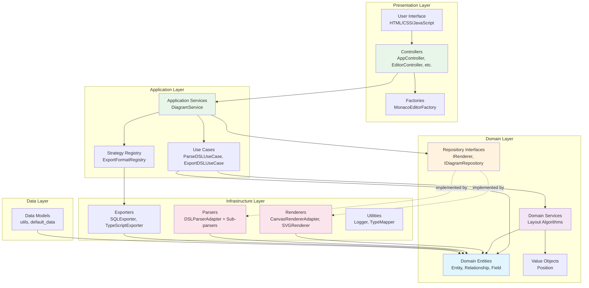
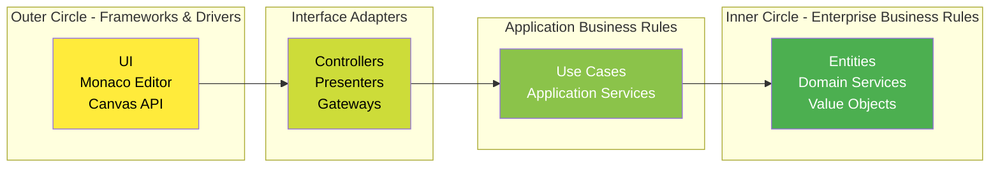
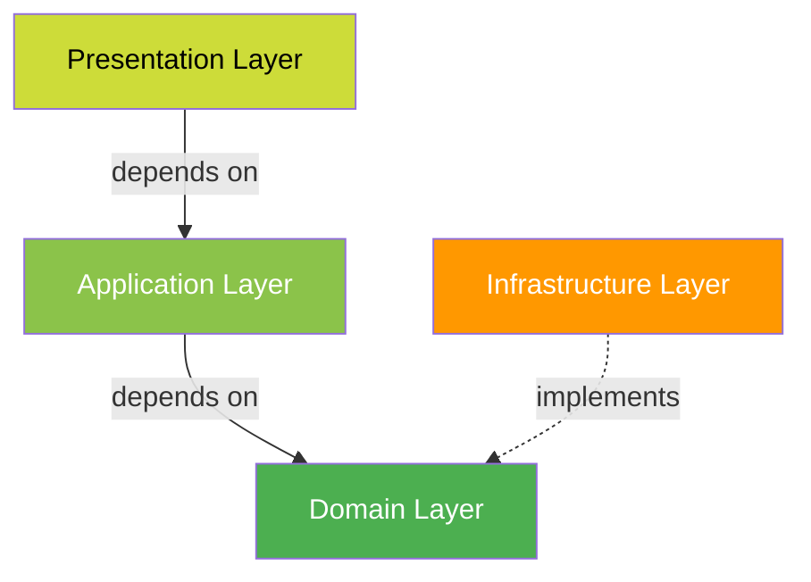
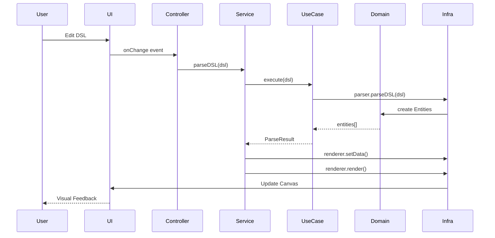

# System Architecture

This document describes the overall system architecture of the ERP Visual Designer application.

## High-Level System Architecture

## Clean Architecture Layers

## Dependency Flow

The architecture follows the **Dependency Inversion Principle** where:
- Outer layers depend on inner layers
- Inner layers are independent of outer layers
- All dependencies point inward toward the domain

## Key Architectural Principles Applied

### 1. Clean Architecture
- **Separation of Concerns**: Each layer has distinct responsibilities
- **Dependency Rule**: Dependencies point inward
- **Framework Independence**: Core business logic independent of frameworks

### 2. SOLID Principles (90% Score)
- ✅ **Single Responsibility**: Each class has one reason to change
- ✅ **Open/Closed**: Open for extension, closed for modification
- ✅ **Liskov Substitution**: Subtypes are substitutable (documented)
- ✅ **Interface Segregation**: Focused, client-specific interfaces
- ✅ **Dependency Inversion**: Depend on abstractions, not concretions

### 3. Design Patterns
- **Strategy Pattern**: ExportFormatRegistry, TypeMapper
- **Factory Pattern**: MonacoEditorFactory
- **Adapter Pattern**: CanvasRendererAdapter, DSLParserAdapter
- **Orchestrator Pattern**: AppController, LayerClassificationOrchestrator
- **Singleton Pattern**: Logger

## Data Flow

## Benefits of This Architecture

1. **Testability**: Easy to mock dependencies and test in isolation
2. **Maintainability**: Clear structure makes code easy to understand and modify
3. **Scalability**: Easy to add new features without modifying existing code
4. **Flexibility**: Easy to swap implementations (e.g., Canvas ↔ SVG renderer)
5. **Reusability**: Domain logic can be reused across different interfaces
6. **Independence**: Business logic independent of UI, database, or frameworks
